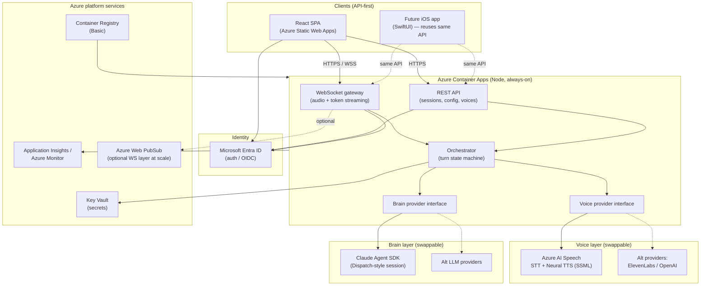
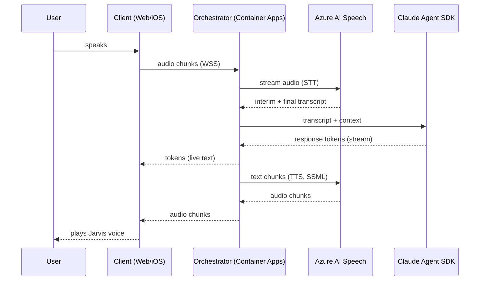

# Jarvis — Azure-Native Architecture & Implementation Plan

> Founding design document for **Jarvis**, a hosted, voice-driven AI assistant that drives an agentic ("Dispatch-style") Claude session.
> Status: **Planning only — no Azure changes made.** This document records agreed decisions and open questions.
> Last updated: 2026-06-10

---

## 1. Overview & Goals

Jarvis is a hosted, voice-driven AI interface inspired by the "Jarvis from the Avengers" concept: you talk to it, it answers in a calm British voice, and it can carry out real work by driving an agentic Claude session behind the scenes. Typed text input is supported as a first-class alternative to voice.

**Primary goals**

- **Natural voice interaction.** Speak to Jarvis and hear a calm British male assistant voice respond, with low enough latency to feel conversational. The voice is *switchable* to other voices as a product feature.
- **Typed input parity.** Everything you can do by voice you can also do by typing. Voice is a layer on top of a text-first core.
- **Drives a "Dispatch session in Claude."** Jarvis is not just a chatbot — it orchestrates an agentic Claude session (the "Dispatch" concept) that can plan, call tools, and execute multi-step tasks.
- **API-first.** The backend exposes a clean API so that a future native **iOS (SwiftUI)** app can reuse exactly the same contract. The web (React) app is simply the first client, not the product boundary.
- **Azure-native.** Built entirely on Azure managed services for hosting, identity, secrets, and observability, deployable into an existing subscription.
- **Cost-aware.** Runs cheaply for personal use, scales up only when needed, and leans on the user's existing Claude **Max** subscription credit for the LLM bill where possible.

**Non-goals (for now)**

- Cloning the actual film/Paul Bettany Jarvis voice (see §4 — this is an IP/likeness boundary we deliberately respect).
- Multi-tenant SaaS. v1–v3 target a single primary user; the architecture doesn't preclude multi-user later but we don't design for it yet.

**Design principles**

1. **Provider abstraction everywhere it matters** — voice (STT/TTS) and brain (LLM) both sit behind swappable interfaces so we are never locked to one vendor.
2. **Text is the spine.** Audio is encoded to text on the way in and generated from text on the way out. The core conversation loop is text; voice is an adapter.
3. **Stream by default.** Token streaming and audio streaming are the norm, not an enhancement, because latency is the whole user experience.
4. **Secrets never touch source.** Identity via Entra ID, secrets via Key Vault, managed identity for service-to-service auth.

---

## 2. Architecture

### 2.1 Component diagram

### 2.2 End-to-end flow — a **voice turn**

1. **Capture.** The client opens a WebSocket (WSS) to the backend and streams microphone audio (e.g. 16 kHz PCM/Opus chunks) as the user speaks. A presence/auth token (Entra ID) is attached at connection time.
2. **STT (streaming).** The orchestrator forwards audio chunks through the **Voice provider interface** to **Azure AI Speech** real-time Speech-to-Text. Partial ("interim") transcripts stream back so the UI can show live captions; a final transcript is emitted on end-of-utterance (silence detection or client signal).
3. **Brain (Claude Agent SDK, streaming).** The final transcript (plus conversation/session context) is handed to the **Brain provider interface**, which calls **Claude via the Claude Agent SDK**. In v2+ this is a full Dispatch-style agentic session: Claude can plan and invoke tools. Response tokens stream back to the orchestrator as they're generated.
4. **Token streaming to client.** As text tokens arrive, they're relayed over the same WebSocket to the client so the user sees the answer forming in real time.
5. **TTS (streaming).** In parallel, the orchestrator chunks the streaming text (sentence- or clause-boundary) and sends each chunk through the Voice interface to **Azure AI Speech Neural TTS** using the selected British neural voice and **SSML** (for prosody, pauses, emphasis). Synthesized audio streams back.
6. **Playback.** The client plays the audio as it arrives (chunked playback), giving a "Jarvis is speaking" experience with minimal lead-in latency. Barge-in (user interrupts) cancels in-flight TTS and reopens STT.

### 2.3 End-to-end flow — a **typed turn**

Identical to the voice turn but with the audio adapters bypassed on the way in, and TTS optional on the way out:

1. **Capture.** User types a message; client sends it over REST (`POST /sessions/{id}/messages`) or the existing WebSocket.
2. **STT skipped.** The text *is* the transcript.
3. **Brain.** Same Claude Agent SDK path; tokens stream back over WebSocket (or Server-Sent Events for a pure-REST client).
4. **Token streaming to client.** Live text as above.
5. **TTS (optional).** If the user has "speak responses" enabled, the same TTS path runs and audio is streamed for playback; otherwise the turn ends as text only.

The key point: **the text core is shared.** Voice in and voice out are adapters bolted onto the same orchestrator turn, which is what makes typed and spoken interaction first-class equals and what lets the iOS app reuse everything.

### 2.4 How voice-switching works

- The **Voice provider interface** exposes a small contract: `listVoices()`, `synthesize(text, voiceId, ssmlOptions) -> audioStream`, and `transcribe(audioStream) -> transcriptStream`.
- Each concrete provider (Azure AI Speech today; ElevenLabs / OpenAI later) implements this interface and registers the voices it offers, each with a stable `voiceId`, display name, locale, gender, and "style" tags.
- The selected voice is **session/user configuration**, persisted and returned by `GET /voices` and set via `PATCH /sessions/{id}` (or a user-preferences endpoint). The **default is a calm British male neural voice** (see §4).
- Switching voice is just changing the active `voiceId`; the orchestrator passes it to whichever provider owns that voice. Because the interface is provider-agnostic, a voice from Azure and a voice from ElevenLabs appear in the same picker and "just work."
- SSML/prosody options are normalized at the interface boundary so provider-specific markup stays inside the adapter.

---

## 3. Component-by-Component Design

**Front end — Azure Static Web Apps (React SPA).** Static Web Apps gives globally distributed static hosting, free/managed TLS, built-in **Entra ID** authentication, and native **GitHub Actions** deployment — ideal for a React SPA. It also offers a clean split between the static client and the API backend (which we keep in Container Apps rather than SWA's bundled Functions, because we need always-on WebSockets). *Why:* lowest-friction, lowest-cost way to host and auth a SPA on Azure.

**Backend — Azure Container Apps (Node, always-on).** Container Apps runs our Node orchestrator as a managed container with support for **always-on** instances (min replicas ≥ 1) and **WebSockets** for streaming audio in and tokens out. It scales on HTTP/concurrency, integrates with managed identity, Key Vault, and Application Insights, and pulls images from ACR. *Why:* we need a persistent, WebSocket-capable, horizontally scalable container host without running Kubernetes ourselves.
- *Simpler alternative:* **Azure App Service** (Web App for Containers) also supports WebSockets and always-on and is operationally simpler; noted as a fallback if Container Apps proves heavier than needed for a single-user workload.
- *At scale:* **Azure Web PubSub** can offload WebSocket fan-out/connection management as a managed real-time layer if connection counts grow beyond what one backend should hold. Optional; not needed for v1.

**Voice — Azure AI Speech.** Provides real-time streaming **Speech-to-Text** and **Neural Text-to-Speech** with a large catalog of British neural voices, full **SSML** support, and word-level timing. Sits behind our Voice provider interface so it's swappable. *Why:* first-party Azure service, strong British voice options, streaming on both directions, predictable pricing.

**Brain — Claude via the Claude Agent SDK.** The backend calls Claude through the **Claude Agent SDK**, which lets us run a Dispatch-style agentic session (planning + tool use) and, critically, authenticate against the user's **Claude Max** subscription so usage draws on the included credit (see §5). Kept behind a Brain provider interface so an alternate LLM could drop in. *Why:* agentic capability + Max credit economics + provider abstraction.

**Secrets — Azure Key Vault.** All API keys, tokens, and connection strings live in Key Vault, accessed by the backend via **managed identity** (no secrets in code, config, or images). *Why:* centralized, audited, rotatable secret storage with RBAC.

**Registry — Azure Container Registry (Basic).** Stores the backend container images that Container Apps deploys. Basic tier is sufficient for a single-app, single-user project. *Why:* private, Azure-native image hosting wired into the CI/CD pipeline.

**Observability — Application Insights / Azure Monitor.** Distributed tracing, request/dependency telemetry, live metrics, and logs for the backend; alerting via Azure Monitor. Lets us see end-to-end turn latency (capture → STT → Claude → TTS → playback), error rates, and cost-driving call volumes. *Why:* essential for tuning a latency-sensitive streaming app and for catching failures.

**Subscription/landing.** Can deploy into one of the user's existing subscriptions — **DCP-AZURE-Pay-As-You-Go** or **Dutch Country Production**. Final choice is an open decision (§11). All resources grouped in a dedicated resource group (e.g. `rg-jarvis-<env>`).

---

## 4. Voice Strategy

**Default voice.** Jarvis ships with a **calm British male neural voice** as the default, e.g. Azure AI Speech **`en-GB-RyanNeural`** or **`en-GB-ThomasNeural`**. Final pick is an open decision (§11) — we'll A/B the two for the calmest, most "assistant-like" delivery and tune prosody with SSML (measured pace, slight warmth, no over-emphasis).

**Likeness / IP boundary — important.** We **cannot and will not** clone the actual Paul Bettany / film Jarvis voice. That is a real-person voice likeness and film IP; reproducing it is an intellectual-property and likeness-rights problem. We deliberately default to a *distinct* British neural voice that evokes the same calm-British-butler register **without** imitating any real person or protected character. This is a firm product constraint, not a temporary limitation.

**Swappable provider interface.** As described in §2.4, the voice layer is provider-agnostic. Azure AI Speech is the v1 provider, but **ElevenLabs** or **OpenAI** voices can be added by implementing the same interface and registering their voices into the picker — no orchestrator changes required.

**Future — Custom Neural Voice.** Azure AI Speech offers **Custom Neural Voice (CNV)**, which can create a bespoke, brand-specific voice from consented recordings (CNV is gated/limited-access and requires the voice talent's explicit consent). This is a **future option** for giving Jarvis a unique, owned voice identity — again, built from a *consented original* voice actor, never a cloned celebrity. Flagged as a later enhancement, not v1.

---

## 5. Claude Integration

### 5.1 Auth tradeoff — Agent SDK (subscription) vs Console API key

There are two distinct ways to authenticate Claude usage, with different billing:

- **Claude Agent SDK on the Max subscription.** If Jarvis authenticates through the **Agent SDK using the user's Claude Max subscription**, usage draws on the **included programmatic Max credit** (roughly **$100/mo on Max 5x**, **$200/mo on Max 20x**). For personal/always-on use this can make the LLM bill effectively *$0 incremental* up to the credit ceiling.
- **Console API key (pay-as-you-go).** A plain Anthropic **Console API key** is **separate, metered pay-as-you-go** billing — it does **not** draw on the Max subscription credit. Simpler to provision, but you pay per token on top of the Max subscription.

**Recommendation:** authenticate via the **Agent SDK on the subscription** to leverage the Max credit, and keep a Console API key path available behind the same Brain interface as a fallback / overflow once the monthly credit is exhausted. **Which Max tier (5x vs 20x)** the user is on is still **TBD** and is an open decision (§11) — it sets the monthly credit ceiling and therefore how much Jarvis usage is "free."

> **Tradeoff to keep visible:** subscription auth = cheaper (uses included credit) but tied to subscription login/session semantics and the credit ceiling; API-key auth = simplest and unlimited-by-billing but fully metered. The Brain abstraction lets us switch or combine without touching the rest of the system.

### 5.2 Driving a "Dispatch-style" agentic session

- The orchestrator opens an **Agent SDK session** per Jarvis conversation. This is the "Dispatch in Claude" model: Claude operates agentically — it can reason, plan, and (in v2+) call **tools** exposed to the session — rather than answering a single prompt in isolation.
- Conversation state (history, system framing of "you are Jarvis," and the user's current goal) is maintained across turns within the session.
- **Tools** (v2): file/workspace access, web actions, calendar/email connectors, etc., are registered with the agent session so a single spoken request ("Jarvis, summarize today's emails and draft replies") can fan out into multiple tool calls and come back as one spoken summary.
- The session is owned server-side in the backend; clients never hold Claude credentials — they only see the streamed text/audio.

### 5.3 Streaming

- The Agent SDK call is consumed as a **token stream** in the backend.
- Tokens are relayed to the client live (WebSocket) **and** chunked at clause/sentence boundaries into the TTS pipeline so speech begins before the full answer is generated — this is what keeps spoken latency low.
- Tool-call steps in the agentic session can emit lightweight status events ("looking that up…") so the UI and voice can acknowledge work in progress.

---

## 6. Security & Identity

- **Authentication — Microsoft Entra ID.** Both the Static Web App and the backend authenticate users via **Entra ID (OIDC)**. The SPA acquires a token; the backend validates it on every REST call and at WebSocket connection time. No anonymous access to the brain or voice endpoints.
- **Secrets — Azure Key Vault + managed identity.** Anthropic/Claude credentials, Speech keys, and any provider tokens live **only** in Key Vault. The Container App reads them at runtime via its **managed identity** — no secrets in source, environment files committed to git, container images, or client code. **Do not hardcode tokens** anywhere.
- **Least privilege.** The backend's managed identity gets only `get`/`list` on the specific Key Vault secrets it needs and `pull` on ACR. Static Web Apps has no access to secrets. Each resource's RBAC is scoped to the minimum role.
- **Transport security.** HTTPS everywhere; WebSockets over **WSS**. TLS is managed by Static Web Apps and Container Apps ingress.
- **Client trust boundary.** Clients are untrusted: they never receive Claude or Speech credentials. All provider calls are server-side. The client only ever sees its own user token and the streamed results.
- **Secret rotation & audit.** Key Vault enables rotation without redeploy and gives an access audit trail via Azure Monitor. Provider keys can be rotated independently of the app.

---

## 7. API-First Contract

The contract is defined so the **future iOS (SwiftUI) app reuses it verbatim** — the web app holds no privileged path. Sketch (illustrative shapes, to be firmed up):

**REST**

| Method & path | Purpose |
|---|---|
| `POST /sessions` | Create a Jarvis conversation session; returns `sessionId`. |
| `GET /sessions/{id}` | Fetch session state/config (active voice, speak-responses flag, history cursor). |
| `PATCH /sessions/{id}` | Update session config (e.g. set active `voiceId`, toggle TTS). |
| `POST /sessions/{id}/messages` | Send a typed message; returns a stream handle (or streams via SSE). |
| `GET /sessions/{id}/messages` | Retrieve conversation history. |
| `GET /voices` | List available voices across all registered providers (id, name, locale, gender, style). |
| `GET /me` / `GET /config` | Current user + client bootstrap config (auth, feature flags, default voice). |
| `GET /healthz` | Liveness/readiness for the platform. |

**WebSocket** (`/realtime`, WSS, Entra token on connect)

Client → server messages:
- `audio.chunk` — binary/base64 audio frames for streaming STT.
- `audio.end` — end-of-utterance signal.
- `text.message` — typed input over the socket.
- `control.barge_in` — user interrupted; cancel in-flight TTS.
- `control.set_voice` — change active voice mid-session.

Server → client events:
- `stt.partial` / `stt.final` — interim and final transcripts.
- `brain.token` — streamed response text tokens.
- `brain.status` — agentic step/tool-call status updates.
- `tts.audio` — streamed synthesized audio chunks.
- `turn.complete` / `error` — turn lifecycle.

**Contract principles:** versioned (`/v1`), JSON for control + binary frames for audio, auth identical across REST and WS, and **no client-specific endpoints** — the iOS app speaks the same protocol. An OpenAPI/AsyncAPI spec is a v1 deliverable so the SwiftUI client can codegen against it.

---

## 8. CI/CD

Deploy from the **Jarvis GitHub repo** using **GitHub Actions**, with two pipelines triggered on merge to `main`:

1. **Frontend → Azure Static Web Apps.** The Static Web Apps GitHub Action builds the React SPA and publishes it. Preview environments per pull request come for free with SWA.
2. **Backend → Azure Container Apps.** Action builds the Node container, pushes to **Azure Container Registry (Basic)**, and updates the Container App to the new image revision (enabling revision-based rollback). Authentication to Azure uses an **Entra workload identity / OIDC federation** from GitHub Actions — **no long-lived cloud credentials stored in GitHub secrets**.

**Conventions**
- Infrastructure as code (Bicep or Terraform) for the resource group, Container App, ACR, Key Vault, Speech resource, Static Web App, and App Insights — so environments are reproducible.
- Secrets flow GitHub → Azure only via OIDC federation; runtime app secrets live in Key Vault, never in Actions logs.
- Environments: at minimum `prod`; optionally a `dev`/preview slot. Container Apps revisions give safe rollouts.

---

## 9. Phased Roadmap

### v1 — Text + voice chat loop to Claude (default British voice + voice picker)
**Goal:** a working hosted Jarvis you can talk or type to, that answers via Claude and speaks back in a calm British voice, with a working voice switcher.

Deliverables:
- React SPA on Static Web Apps with Entra ID login.
- Node orchestrator on Container Apps (always-on, WebSocket) with the REST + WS contract from §7 (v1 subset).
- Azure AI Speech integrated behind the Voice provider interface: streaming STT in, Neural TTS out, default `en-GB` voice + SSML.
- **Voice picker** populated from `GET /voices`; switching works live.
- Claude via Agent SDK behind the Brain interface (subscription auth), with token streaming → live text + chunked TTS.
- Key Vault + managed identity; ACR; App Insights; GitHub Actions for both pipelines.
- OpenAPI/AsyncAPI spec published for the contract.

### v2 — Full Dispatch / agent driving + tools
**Goal:** Jarvis stops being a chat box and starts *doing things*.

Deliverables:
- Full agentic Dispatch-style session via the Agent SDK: planning, multi-step execution, **tool use**.
- Tool registrations (e.g. workspace/files, web actions, calendar/email connectors) surfaced through the session.
- `brain.status` step/tool events wired to UI and voice ("working on it…").
- Barge-in / interruption handling polished.
- Optional Web PubSub evaluation if connection load warrants it.
- Cost/credit telemetry (track Max-credit burn vs. API-key fallback).

### v3 — Native iOS (SwiftUI) app
**Goal:** Jarvis in your pocket, reusing the same backend.

Deliverables:
- SwiftUI client implementing the **same REST + WS contract** (codegen from the published spec).
- Native audio capture/playback + barge-in tuned for mobile.
- Entra ID auth on iOS.
- Background/locked-screen voice ergonomics as feasible.
- Feature parity with web (voice picker, typed/voice, Dispatch tools).

---

## 10. Cost Summary

Two Azure scenarios were already estimated (kept brief here; see the dedicated cost doc for the line-item breakdown):

- **Lean / Personal — ~$0–5/mo Azure.** Scale-to-zero or minimal footprint; you pay essentially only for what you use. Best when Jarvis is used occasionally and a cold-start delay is acceptable.
- **Always-On / Responsive — ~$66/mo Azure.** A persistent backend replica (no cold starts), responsive streaming, plus Speech, registry, and monitoring. Best for a true always-listening assistant experience.

**Claude (the brain)** is expected to be **largely covered by the Max subscription credit** when authenticated via the Agent SDK on the subscription (~$100/mo on Max 5x / ~$200/mo on Max 20x of included programmatic usage). Net effect: for personal use, the dominant variable cost (the LLM) can be ~$0 incremental up to the credit ceiling, leaving Azure infra as the main spend. The always-on vs scale-to-zero choice (§11) is the biggest Azure cost lever.

---

## 11. Open Decisions / TODOs

| # | Decision | Notes |
|---|---|---|
| 1 | **Claude Max tier: 5x vs 20x** | Sets the monthly programmatic credit ceiling (~$100 vs ~$200) and therefore how much Jarvis usage is "free." TBD. |
| 2 | **Azure region** | Pick a region with Azure AI Speech neural voices + Container Apps, close to the user for latency. |
| 3 | **Which subscription** | `DCP-AZURE-Pay-As-You-Go` vs `Dutch Country Production`. |
| 4 | **Default voice pick** | `en-GB-RyanNeural` vs `en-GB-ThomasNeural` (or another `en-GB` male neural) — choose the calmest assistant delivery. |
| 5 | **Scale-to-zero vs always-on** | Drives the ~$0–5 vs ~$66/mo Azure cost and the cold-start UX tradeoff. |
| 6 | **Backend host** | Container Apps (default) vs App Service (simpler) — confirm Container Apps is worth the extra surface for a single-user workload. |
| 7 | **Web PubSub** | Defer unless/until connection scale justifies a managed WS layer. |
| 8 | **IaC tool** | Bicep vs Terraform for reproducible environments. |
| 9 | **API-key fallback** | Confirm whether to wire a Console API key path for overflow once Max credit is exhausted. |

---

*This document is the founding architecture/design reference for Jarvis. It records agreed decisions and open questions; no Azure resources have been created or modified.*
